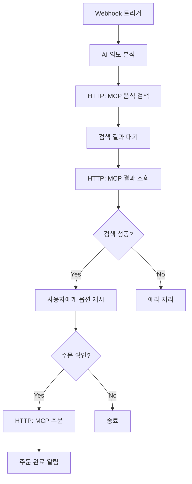
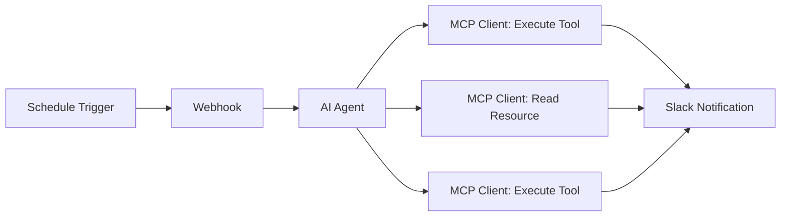
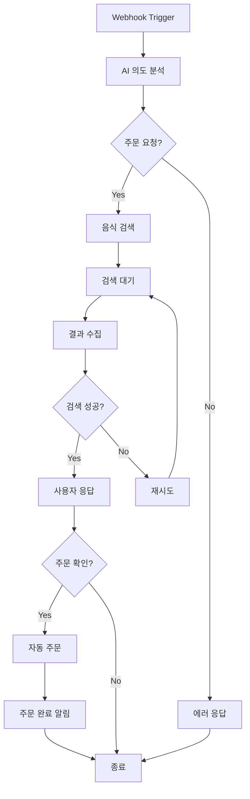

# Uber Eats MCP 시나리오 - n8n 노코드 구현 가이드

> n8n을 활용하여 코드 없이 Uber Eats 자동 주문 시스템 구축하기

## 목차
- [프로젝트 개요](#프로젝트-개요)
- [n8n 환경 설정](#n8n-환경-설정)
- [구현 방법 비교](#구현-방법-비교)
- [방법 1: 기존 MCP 서버만 사용](#방법-1-기존-mcp-서버만-사용)
  - [Claude Desktop 설정](#claude-desktop-설정)
  - [사용 방법](#사용-방법)
  - [장점과 단점](#장점과-단점)
- [방법 2: n8n + MCP 서버 (권장)](#방법-2-n8n--mcp-서버-권장)
  - [방법 2-A: HTTP Request 방식](#방법-2-a-http-request-방식)
    - [MCP HTTP 래퍼 설정](#mcp-http-래퍼-설정)
    - [n8n 워크플로우 구성](#n8n-워크플로우-구성)
    - [실제 동작 예시](#실제-동작-예시)
  - [방법 2-B: MCP 노드 방식 (최고 권장)](#방법-2-b-mcp-노드-방식-최고-권장)
    - [n8n MCP 노드 설정](#n8n-mcp-노드-설정)
    - [워크플로우 구성](#워크플로우-구성)
    - [실제 동작 예시](#실제-동작-예시-1)
  - [방법 2 장점과 단점](#방법-2-장점과-단점)
- [방법 3: n8n Only (완전 노코드)](#방법-3-n8n-only-완전-노코드)
  - [순수 n8n 워크플로우](#순수-n8n-워크플로우)
  - [노드별 상세 설정](#노드별-상세-설정)
  - [AI 통합 설정](#ai-통합-설정)
- [실제 동작 시나리오](#실제-동작-시나리오)
- [고급 설정](#고급-설정)
- [트러블슈팅](#트러블슈팅)
- [배포 및 운영](#배포-및-운영)
- [활용 확장 아이디어](#활용-확장-아이디어)
- [결론](#결론)

---

## 프로젝트 개요

### 목표
기존 Python/MCP 기반 Uber Eats 자동화를 **n8n 노코드 워크플로우**로 구현하여:
- 비개발자도 쉽게 설정 가능
- 시각적 워크플로우로 직관적 관리
- 웹 UI에서 실시간 모니터링
- 다양한 서비스와 쉬운 연동

### 핵심 기능
1. **자연어 주문 처리**: "계피빵 주문해줘" → 자동 분석
2. **웹 자동화**: Uber Eats 사이트 자동 조작
3. **실시간 알림**: 슬랙, 이메일, 카카오톡 등
4. **에러 처리**: 실패 시 자동 재시도 및 알림

---

## n8n 환경 설정

### 1. n8n 설치 방법

#### 방법 1: Docker (추천)
```bash
# n8n Docker 실행
docker run -it --rm \
  --name n8n \
  -p 5678:5678 \
  -e WEBHOOK_URL=http://localhost:5678/ \
  -e N8N_BASIC_AUTH_ACTIVE=true \
  -e N8N_BASIC_AUTH_USER=admin \
  -e N8N_BASIC_AUTH_PASSWORD=password \
  -v ~/.n8n:/home/node/.n8n \
  n8nio/n8n
```

#### 방법 2: npm 설치
```bash
# npm으로 설치
npm install n8n -g
n8n start

# 브라우저에서 접속
# http://localhost:5678
```

### 2. 필수 환경 변수 설정
```bash
# .env 파일 생성
ANTHROPIC_API_KEY=sk-ant-api03-xxxxx
OPENAI_API_KEY=sk-xxxxx
WEBHOOK_URL=http://localhost:5678/webhook/uber-eats
SLACK_WEBHOOK_URL=https://hooks.slack.com/xxxxx
```

### 3. 필요한 n8n 노드들
- **HTTP Request**: 웹사이트 접근용
- **Webhook**: 외부 트리거 수신
- **OpenAI/Anthropic**: AI 분석용  
- **Browser Automation**: 웹 자동화
- **Slack/Email**: 결과 알림용
- **Code**: JavaScript 커스텀 로직
- **If/Switch**: 조건부 분기
- **Wait**: 시간 지연

---

## 구현 방법 비교

### 세 가지 접근법

| 구분 | 방법 1: 기존 MCP 서버만 | 방법 2: n8n + MCP 서버 | 방법 3: n8n Only |
|------|----------------------|---------------------|------------------|
| **코드 필요성** | Python (MCP만) | Python (MCP만) | 완전 노코드 |
| **복잡도** | 낮음 (MCP만) | 보통 (두 시스템 연동) | 낮음 (단일 시스템) |
| **안정성** | 높음 | 높음 | 보통 |
| **자동화 수준** | 낮음 (수동 대화) | 높음 (완전 자동화) | 보통 (n8n 워크플로우) |
| **확장성** | 높음 (MCP 생태계) | 높음 (MCP + n8n) | 보통 (n8n만) |
| **브라우저 자동화** | Browser-Use (고도화) | Browser-Use (고도화) | HTTP Request (기본) |
| **사용 방법** | Claude Desktop 대화 | n8n 워크플로우 | n8n 워크플로우 |

### 방법 2의 두 가지 연결 방식

| 구분 | 방법 2-A: HTTP Request | 방법 2-B: MCP 노드 |
|------|---------------------|------------------|
| **연결 방식** | MCP → HTTP 래퍼 → n8n | MCP → n8n MCP 노드 |
| **설정 복잡도** | 보통 (래퍼 서버 필요) | 낮음 (직접 연결) |
| **안정성** | 높음 | 높음 |
| **유지보수** | 보통 (두 서버 관리) | 쉬움 (MCP만 관리) |
| **추천도** | ⭐⭐⭐ | ⭐⭐⭐⭐⭐ |

### 세 가지 방법 완벽 정리

#### 각 방법의 핵심 차이점

**방법 1: 기존 MCP 서버만**
- Claude Desktop과 직접 대화
- 가장 간단하지만 자동화 한계

**방법 2: n8n + MCP 서버** **권장**
- 완전 자동화 워크플로우 구축
- 두 가지 연결 방식 선택 가능
  - **방법 2-A**: HTTP Request 방식
  - **방법 2-B**: MCP 노드 방식 (최고 권장)

**방법 3: n8n Only**
- 순수 n8n만 사용
- Python 불필요하지만 기능 제한

### 최종 권장사항
- **🥇 최고**: 방법 2-B (MCP 노드 방식) - 완전 자동화 + 간편함
- **🥈 좋음**: 방법 2-A (HTTP Request 방식) - 완전 자동화 + 범용성
- **🥉 시작**: 방법 1 (기존 MCP 서버만) - 빠른 프로토타이핑
- **⚠️ 제한적**: 방법 3 (n8n Only) - 환경 제약 시만

---

## 방법 1: 기존 MCP 서버만 사용

### 시스템 구성
```
사용자 → Claude Desktop → MCP 서버 → Browser-Use → Uber Eats
```

### 개요
- **기존 Python MCP 서버 그대로 사용**
- Claude Desktop에서 직접 대화로 주문
- **가장 단순한 방법**이지만 자동화 한계

### Claude Desktop 설정

#### 1. MCP 서버 실행
```bash
# 기존 server.py 그대로 사용
cd uber-eats-mcp-server
python server.py
# MCP 서버가 stdio 모드로 실행됨
```

#### 2. Claude Desktop에서 MCP 설정
```json
// ~/.claude_desktop_config.json
{
  "mcpServers": {
    "uber-eats": {
      "command": "python",
      "args": ["/path/to/uber-eats-mcp-server/server.py"],
      "env": {
        "ANTHROPIC_API_KEY": "your_key_here",
        "OPENAI_API_KEY": "your_key_here"
      }
    }
  }
}
```

### 사용 방법
Claude Desktop에서 직접 대화:
```
사용자: "계피빵 주문하고 싶어요"

Claude: MCP find_menu_options 도구를 사용하여 검색하겠습니다.
[find_menu_options("계피빵") 실행]

잠시만요, 검색 중입니다...
[2분 대기 후 결과 조회]

7-Eleven에서 계피빵을 찾았습니다. 주문하시겠습니까?

사용자: "네, 주문해주세요"

Claude: [order_food() 실행]
주문이 완료되었습니다!
```

### 장점과 단점

#### 장점
- **가장 단순**: 기존 코드 그대로 사용
- **MCP 순수 활용**: 프로토콜 본래 목적에 맞게 사용
- **별도 서버 불필요**: n8n이나 HTTP 래퍼 없음
- **Claude와 완벽 통합**: 자연스러운 대화형 인터페이스

#### 단점
- **자동화 한계**: 사용자가 직접 Claude와 대화해야 함
- **워크플로우 부족**: n8n처럼 복잡한 자동화 어려움
- **알림 기능 부족**: 슬랙이나 이메일 알림 등 부가 기능 부족

---

## 방법 2: n8n + MCP 서버 (권장)

### 시스템 구성 개요
```
사용자 → n8n 웹훅 → [MCP 연결] → MCP 서버 → Browser-Use → Uber Eats → n8n 알림
```

### 핵심 장점
- **완전 자동화**: 사용자 개입 없이 전체 프로세스 자동화
- **MCP 장점 활용**: Browser-Use의 고도화된 브라우저 자동화  
- **워크플로우 확장**: 슬랙, 이메일 등 다양한 알림 연동
- **두 가지 연결 방식**: HTTP Request 또는 MCP 노드 선택 가능

### 방법 2-A: HTTP Request 방식

#### 시스템 구성
```
사용자 → n8n 웹훅 → n8n HTTP Request → MCP HTTP 래퍼 → MCP 서버 → Browser-Use → Uber Eats
```

#### MCP HTTP 래퍼 설정

##### 1. MCP 서버 실행
```bash
# 기존 server.py 그대로 사용
cd uber-eats-mcp-server
python server.py
# MCP 서버가 stdio 모드로 실행됨
```

##### 2. HTTP 래퍼 서버 생성
MCP 서버를 HTTP API로 래핑하는 서버를 만듭니다:

```python
# mcp_http_wrapper.py
from fastapi import FastAPI
from fastapi.middleware.cors import CORSMiddleware
import subprocess
import json
import asyncio
from typing import Dict, Any

app = FastAPI()

app.add_middleware(
    CORSMiddleware,
    allow_origins=["*"],
    allow_credentials=True,
    allow_methods=["*"],
    allow_headers=["*"],
)

class MCPClient:
    def __init__(self):
        self.process = None
        self.setup_mcp_connection()
    
    def setup_mcp_connection(self):
        """MCP 서버와 연결 설정"""
        self.process = subprocess.Popen(
            ['python', 'server.py'],
            stdin=subprocess.PIPE,
            stdout=subprocess.PIPE,
            stderr=subprocess.PIPE,
            text=True
        )
    
    async def call_tool(self, tool_name: str, parameters: Dict[str, Any]) -> str:
        """MCP 도구 호출"""
        request = {
            "jsonrpc": "2.0",
            "id": 1,
            "method": "tools/call",
            "params": {
                "name": tool_name,
                "arguments": parameters
            }
        }
        
        # MCP 서버에 요청 전송
        self.process.stdin.write(json.dumps(request) + '\n')
        self.process.stdin.flush()
        
        # 응답 받기
        response = self.process.stdout.readline()
        return json.loads(response)

mcp_client = MCPClient()

@app.post("/find_menu_options")
async def find_menu_options(request: dict):
    """음식 검색 API"""
    search_term = request.get("search_term", "")
    result = await mcp_client.call_tool("find_menu_options", {
        "search_term": search_term
    })
    return {"status": "success", "data": result}

@app.post("/order_food")
async def order_food(request: dict):
    """음식 주문 API"""
    item_url = request.get("item_url", "")
    item_name = request.get("item_name", "")
    result = await mcp_client.call_tool("order_food", {
        "item_url": item_url,
        "item_name": item_name
    })
    return {"status": "success", "data": result}

@app.get("/search_results/{request_id}")
async def get_search_results(request_id: str):
    """검색 결과 조회 API"""
    # MCP 리소스 조회 로직 구현
    return {"status": "success", "request_id": request_id}

if __name__ == "__main__":
    import uvicorn
    uvicorn.run(app, host="0.0.0.0", port=8000)
```

##### 3. HTTP 래퍼 실행
```bash
# 새 터미널에서 실행
pip install fastapi uvicorn
python mcp_http_wrapper.py
# HTTP API 서버가 http://localhost:8000 에서 실행
```

#### n8n 워크플로우 구성

##### 워크플로우 다이어그램


##### 노드별 설정

###### 1. Webhook 트리거
```json
{
  "httpMethod": "POST",
  "path": "uber-eats-order",
  "responseMode": "responseNode"
}
```

###### 2. AI 의도 분석 (OpenAI)
```json
{
  "model": "gpt-4o",
  "prompt": "사용자 메시지를 분석하여 주문 의도를 파악해주세요: {{ $json.message }}"
}
```

###### 3. HTTP Request: MCP 음식 검색
```json
{
  "method": "POST",
  "url": "http://localhost:8000/find_menu_options",
  "body": {
    "search_term": "{{ $('AI 분석').json.food_item }}"
  }
}
```

###### 4. 검색 결과 대기 (Wait)
```json
{
  "unit": "seconds",
  "amount": 120
}
```

###### 5. HTTP Request: MCP 결과 조회
```json
{
  "method": "GET",
  "url": "http://localhost:8000/search_results/{{ $('MCP 검색').json.request_id }}"
}
```

###### 6. 조건부 분기 (IF)
```json
{
  "conditions": {
    "string": [
      {
        "value1": "={{ $json.status }}",
        "operation": "equal",
        "value2": "success"
      }
    ]
  }
}
```

###### 7. HTTP Request: MCP 주문
```json
{
  "method": "POST",
  "url": "http://localhost:8000/order_food",
  "body": {
    "item_url": "{{ $json.selected_item.url }}",
    "item_name": "{{ $json.selected_item.name }}"
  }
}
```

#### 실제 동작 예시

##### 1. 사용자 요청
```bash
curl -X POST http://localhost:5678/webhook/uber-eats-order \
  -H "Content-Type: application/json" \
  -d '{
    "user_id": "john_doe",
    "message": "계피빵 주문하고 싶어요"
  }'
```

##### 2. n8n 처리 과정
1. **Webhook 수신** → 사용자 메시지 파싱
2. **AI 분석** → "계피빵" 추출
3. **HTTP MCP 호출** → `find_menu_options("계피빵")`
4. **대기** → 2분간 검색 진행
5. **HTTP 결과 조회** → 7-Eleven 계피빵 발견
6. **사용자 응답** → 슬랙 메시지 발송
7. **주문 확인** → 사용자 버튼 클릭
8. **HTTP MCP 주문** → `order_food()` 호출
9. **완료 알림** → 주문 성공 메시지

### 방법 2-B: MCP 노드 방식 (최고 권장)

#### 시스템 구성
```
사용자 → n8n 웹훅 → n8n MCP Client 노드 → MCP 서버 → Browser-Use → Uber Eats → n8n 알림
```

#### MCP 서버 실행

##### 1. 기존 MCP 서버 실행
```bash
# 기존 server.py 그대로 사용
cd uber-eats-mcp-server
python server.py
# MCP 서버가 stdio 모드로 실행됨
```

#### n8n MCP 노드 설정

##### 1. n8n MCP Client 노드 설정
n8n에서 **MCP Client** 노드를 드래그 앤 드롭으로 추가:

**사용 가능한 MCP 액션들:**
- `Execute a tool` → MCP 도구 실행
- `Read a resource` → MCP 리소스 조회  
- `List available tools` → 사용 가능한 도구 목록
- `List available resources` → 사용 가능한 리소스 목록

##### 2. MCP 연결 설정
```json
{
  "serverCommand": "python /path/to/uber-eats-mcp-server/server.py",
  "serverArgs": [],
  "env": {
    "ANTHROPIC_API_KEY": "${ANTHROPIC_API_KEY}",
    "OPENAI_API_KEY": "${OPENAI_API_KEY}"
  }
}
```

#### 워크플로우 구성

##### n8n 워크플로우 다이어그램


##### 노드별 설정

###### 1. Webhook 트리거
```json
{
  "httpMethod": "POST", 
  "path": "uber-eats-order",
  "responseMode": "responseNode"
}
```

###### 2. AI 의도 분석 (OpenAI)
```json
{
  "model": "gpt-4o",
  "prompt": "사용자 메시지를 분석하여 주문 의도를 파악해주세요: {{ $json.message }}"
}
```

###### 3. MCP Client: Execute a tool (find_menu_options)
```json
{
  "operation": "executeATool",
  "toolName": "find_menu_options",
  "toolArguments": {
    "search_term": "{{ $('AI 분석').json.food_item }}"
  }
}
```

###### 4. 검색 결과 대기 (Wait)
```json
{
  "unit": "seconds",
  "amount": 120
}
```

###### 5. MCP Client: Read a resource (get_search_results)
```json
{
  "operation": "readAResource", 
  "resourceUri": "resource://search_results/{{ $('MCP Execute').json.request_id }}"
}
```

###### 6. 조건부 분기 (IF)
```json
{
  "conditions": {
    "string": [
      {
        "value1": "={{ $json.status }}",
        "operation": "equal", 
        "value2": "success"
      }
    ]
  }
}
```

###### 7. MCP Client: Execute a tool (order_food)  
```json
{
  "operation": "executeATool",
  "toolName": "order_food",
  "toolArguments": {
    "item_url": "{{ $json.selected_item.url }}",
    "item_name": "{{ $json.selected_item.name }}"
  }
}
```

#### 실제 동작 예시

##### 1. 드래그 앤 드롭으로 워크플로우 구성
1. **Webhook** 노드 추가
2. **OpenAI** 노드 추가  
3. **MCP Client** 노드 추가 (Execute a tool 선택)
4. **Wait** 노드 추가
5. **MCP Client** 노드 추가 (Read a resource 선택)
6. **IF** 노드 추가
7. **MCP Client** 노드 추가 (Execute a tool 선택)
8. **Slack** 노드 추가

##### 2. 실행 결과
```
사용자: "계피빵 주문하고 싶어요"
AI 분석: "계피빵" 추출
MCP Execute: find_menu_options("계피빵") 실행
대기: 2분간 검색 진행  
MCP Resource: 검색 결과 조회
성공: 7-Eleven 계피빵 발견
MCP Execute: order_food() 실행
알림: 주문 완료!
```

### 방법 2 장점과 단점

#### 공통 장점
- **완전 자동화**: 사용자 개입 없이 전체 프로세스 자동화
- **MCP 장점 활용**: Browser-Use의 고도화된 브라우저 자동화
- **기존 코드 활용**: server.py 그대로 사용
- **워크플로우 확장**: 슬랙, 이메일 등 다양한 알림 연동
- **시각적 관리**: n8n UI에서 직관적 워크플로우 관리

#### 방법 2-A (HTTP Request) 특징
**장점:**
- **범용성**: HTTP API로 다양한 플랫폼에서 활용 가능
- **이해하기 쉬움**: 일반적인 REST API 패턴

**단점:**
- **복잡한 설정**: HTTP 래퍼 서버 추가 구축 필요
- **두 서버 관리**: MCP 서버 + HTTP 래퍼 서버

#### 방법 2-B (MCP 노드) 특징  
**장점:**
- **단순한 구조**: MCP 서버만 필요
- **네이티브 통합**: n8n에서 MCP 프로토콜 직접 지원
- **빠른 통신**: HTTP 오버헤드 없음

**단점:**
- **의존성**: n8n MCP 노드 설치 필요

#### 공통 단점
- **Python 환경**: MCP 서버 실행을 위한 Python 환경 필요

---

## 방법 3: n8n Only (완전 노코드)

### 시스템 구성
```
사용자 → n8n 웹훅 → AI 분석 → 직접 웹 자동화 → Uber Eats → 결과 알림
```

### 순수 n8n 워크플로우

#### 전체 워크플로우 다이어그램


#### 주요 워크플로우 단계

##### 1단계: 트리거 설정
- **노드**: Webhook 
- **용도**: 사용자 음성/텍스트 입력 수신
- **URL**: `/webhook/uber-eats-order`

##### 2단계: AI 의도 분석  
- **노드**: OpenAI/Anthropic
- **용도**: 자연어를 구조화된 주문 정보로 변환
- **출력**: 음식명, 가격대, 기타 조건

##### 3단계: 웹 자동화
- **노드**: HTTP Request + Code
- **용도**: Uber Eats 사이트 자동 조작
- **기능**: 검색, 상품 선택, 주문 처리

##### 4단계: 결과 알림
- **노드**: Slack/Email/카카오톡
- **용도**: 주문 결과를 사용자에게 알림

### 노드별 상세 설정

### 1. Webhook 트리거 노드

#### 설정값
```json
{
  "httpMethod": "POST",
  "path": "uber-eats-order",
  "authentication": "none",
  "options": {
    "rawBody": false,
    "responseMode": "responseNode"
  }
}
```

#### 예상 입력 데이터
```json
{
  "user_id": "user123",
  "message": "오후 간식으로 계피빵 주문하고 싶은데 어디서 살 수 있을까요?",
  "channel": "slack",
  "timestamp": "2024-12-28T15:30:00Z"
}
```

---

### 2. AI 의도 분석 노드 (OpenAI)

#### 설정값
```json
{
  "model": "gpt-4o",
  "temperature": 0.1,
  "maxTokens": 500,
  "prompt": "다음 사용자 메시지를 분석하여 JSON 형태로 변환해주세요..."
}
```

#### 프롬프트 템플릿
```
사용자 메시지: {{ $json.message }}

다음 JSON 형태로 분석 결과를 반환해주세요:
{
  "intent": "food_order|price_check|menu_search|order_cancel",
  "food_item": "음식명",
  "price_range": {"min": 0, "max": 50000},
  "urgency": "low|medium|high",
  "special_requests": ["요청사항들"],
  "confidence": 0.95
}

응답은 JSON만 반환하세요.
```

#### 예상 출력
```json
{
  "intent": "food_order",
  "food_item": "계피빵",
  "price_range": {"min": 2000, "max": 8000},
  "urgency": "medium", 
  "special_requests": ["오후 간식용"],
  "confidence": 0.92
}
```

---

### 3. 웹 자동화 노드 (Browser Automation)

#### HTTP Request 노드 설정
```json
{
  "method": "POST",
  "url": "https://www.ubereats.com/api/search",
  "headers": {
    "User-Agent": "Mozilla/5.0 (Macintosh; Intel Mac OS X 10_15_7) AppleWebKit/537.36",
    "Accept": "application/json",
    "Content-Type": "application/json"
  },
  "body": {
    "query": "{{ $json.food_item }}",
    "location": "Stockholm, SE"
  }
}
```

#### Code 노드 (JavaScript)
```javascript
// 검색 결과 처리 로직
const searchResults = items.map(item => {
  const data = item.json;
  
  // Uber Eats 검색 결과 파싱
  if (data.restaurants && data.restaurants.length > 0) {
    return data.restaurants.map(restaurant => ({
      name: restaurant.name,
      rating: restaurant.rating,
      delivery_time: restaurant.eta_range?.text,
      items: restaurant.items?.filter(item => 
        item.name.toLowerCase().includes($('AI 분석').json.food_item.toLowerCase())
      ) || []
    }));
  }
  
  return [];
}).flat();

// 최적 옵션 선택 로직
const bestOption = searchResults
  .filter(restaurant => restaurant.items.length > 0)
  .sort((a, b) => b.rating - a.rating)[0];

if (bestOption) {
  return [{
    json: {
      status: "success",
      selected_restaurant: bestOption.name,
      selected_item: bestOption.items[0],
      estimated_delivery: bestOption.delivery_time,
      next_action: "confirm_order"
    }
  }];
} else {
  return [{
    json: {
      status: "not_found",
      message: `${$('AI 분석').json.food_item}을(를) 판매하는 가게를 찾을 수 없습니다.`,
      next_action: "suggest_alternatives"
    }
  }];
}
```

---

### 4. 조건부 분기 노드 (IF)

#### 검색 성공/실패 분기
```json
{
  "conditions": {
    "string": [
      {
        "value1": "={{ $json.status }}",
        "operation": "equal",
        "value2": "success"
      }
    ]
  }
}
```

#### 주문 확인 분기
```json
{
  "conditions": {
    "string": [
      {
        "value1": "={{ $json.user_response }}",
        "operation": "contains", 
        "value2": "주문"
      }
    ]
  }
}
```

---

### 5. 슬랙 알림 노드

#### 검색 결과 알림
```json
{
  "channel": "#food-orders",
  "username": "Uber Eats Bot",
  "icon_emoji": ":hamburger:",
  "attachments": [
    {
      "color": "good",
      "title": "🎯 음식 검색 완료!",
      "fields": [
        {
          "title": "음식점",
          "value": "{{ $json.selected_restaurant }}",
          "short": true
        },
        {
          "title": "메뉴",
          "value": "{{ $json.selected_item.name }}",
          "short": true
        },
        {
          "title": "가격",
          "value": "{{ $json.selected_item.price }}원",
          "short": true
        },
        {
          "title": "배달시간",
          "value": "{{ $json.estimated_delivery }}",
          "short": true
        }
      ],
      "actions": [
        {
          "type": "button",
          "text": "주문하기",
          "url": "{{ $json.webhook_url }}/confirm-order?id={{ $json.order_id }}"
        },
        {
          "type": "button", 
          "text": "다른 옵션 보기",
          "url": "{{ $json.webhook_url }}/more-options?id={{ $json.order_id }}"
        }
      ]
    }
  ]
}
```

#### 주문 완료 알림
```json
{
  "channel": "#food-orders",
  "username": "Uber Eats Bot",
  "icon_emoji": ":white_check_mark:",
  "text": "🎉 주문이 성공적으로 완료되었습니다!",
  "attachments": [
    {
      "color": "good",
      "fields": [
        {
          "title": "주문 번호",
          "value": "{{ $json.order_number }}",
          "short": false
        },
        {
          "title": "예상 도착 시간",
          "value": "{{ $json.estimated_arrival }}",
          "short": false
        }
      ]
    }
  ]
}
```

### AI 통합 설정

### 1. OpenAI 노드 고급 설정

#### 다단계 AI 처리
```json
{
  "연속_AI_호출": [
    {
      "단계": "1단계: 의도 분석",
      "prompt": "사용자 요청을 분석하여 주문 의도를 파악해주세요",
      "model": "gpt-4o",
      "temperature": 0.1
    },
    {
      "단계": "2단계: 검색어 최적화", 
      "prompt": "{{ $json.food_item }}에 대한 Uber Eats 검색 최적화 키워드를 생성해주세요",
      "model": "gpt-4o-mini",
      "temperature": 0.3
    },
    {
      "단계": "3단계: 응답 생성",
      "prompt": "검색 결과를 바탕으로 사용자 친화적인 응답을 생성해주세요",
      "model": "gpt-4o",
      "temperature": 0.7
    }
  ]
}
```

### 2. Claude 노드 활용

#### 복잡한 상황 처리
```json
{
  "model": "claude-3-5-sonnet-latest",
  "system_prompt": "당신은 Uber Eats 주문 전문 AI 어시스턴트입니다. 사용자의 음식 주문을 도와주며, 다음 상황들을 처리할 수 있어야 합니다:\n1. 음식명이 모호한 경우 명확화\n2. 가격대가 예산을 초과하는 경우 대안 제시\n3. 배달 불가 지역인 경우 인근 대안 찾기\n4. 품절인 경우 유사 메뉴 추천",
  "max_tokens": 1000,
  "temperature": 0.2
}
```

---

## 실제 동작 시나리오

### 시나리오 1: 성공적인 주문 과정

#### 1단계: 사용자 요청 (Webhook)
```json
POST /webhook/uber-eats-order
{
  "user_id": "john_doe",
  "message": "오후 간식으로 계피빵 주문하고 싶은데 어디서 살 수 있을까요?",
  "channel": "slack",
  "user_name": "John Doe"
}
```

#### 2단계: AI 분석 결과
```json
{
  "intent": "food_search",
  "food_item": "계피빵",
  "meal_type": "afternoon_snack",
  "budget": {"min": 3000, "max": 10000},
  "urgency": "medium",
  "confidence": 0.94
}
```

#### 3단계: Uber Eats 검색
```json
{
  "search_query": "kanelbulle OR cinnamon bun OR 계피빵",
  "location": "Stockholm",
  "filters": {
    "price_range": "low_to_medium",
    "rating_min": 4.0,
    "delivery_time_max": 45
  }
}
```

#### 4단계: 검색 결과 처리
```json
{
  "status": "success",
  "results": [
    {
      "restaurant": "7-Eleven St Eriksgatan 89",
      "item": "계피빵 90g",
      "price": "3,500원",
      "rating": 4.5,
      "delivery_time": "25-35분",
      "availability": "available"
    }
  ],
  "selected_option": 0,
  "reasoning": "McDonald's에서는 계피빵을 판매하지 않아 7-Eleven을 선택했습니다."
}
```

#### 5단계: 사용자 응답 생성
```json
{
  "response_type": "interactive",
  "message": "좋은 소식! 오후 간식용 계피빵 옵션을 찾았습니다:\n\n🥐 **7-Eleven St Eriksgatan 89 - 계피빵 90g**\n- 가격: 3,500원\n- 평점: 4.5★\n- 배달시간: 25-35분\n- 설명: 신선한 90g 계피빵, 오후 간식으로 완벽\n\n이 계피빵을 주문하시겠습니까?",
  "action_buttons": [
    {"text": "주문하기", "action": "confirm_order"},
    {"text": "다른 옵션 보기", "action": "show_alternatives"}
  ]
}
```

### 시나리오 2: 에러 처리 과정

#### 품절 상황 처리
```json
{
  "status": "out_of_stock",
  "message": "죄송합니다. 현재 계피빵이 품절입니다.",
  "alternatives": [
    {
      "item": "시나몬 롤",
      "restaurant": "Café Lagerbäck", 
      "price": "4,200원",
      "similarity": "매우 유사"
    },
    {
      "item": "단팥빵",
      "restaurant": "Paris Baguette",
      "price": "3,800원", 
      "similarity": "단맛 간식"
    }
  ],
  "next_action": "suggest_alternatives"
}
```

---

## 고급 설정

### 1. 에러 처리 및 재시도

#### 재시도 로직 (Code 노드)
```javascript
// 재시도 카운터 초기화
if (!$input.all()[0].json.retry_count) {
  $input.all()[0].json.retry_count = 0;
}

const maxRetries = 3;
const currentRetry = $input.all()[0].json.retry_count;

if (currentRetry < maxRetries) {
  // 재시도 실행
  return [{
    json: {
      ...$input.all()[0].json,
      retry_count: currentRetry + 1,
      action: "retry",
      delay_seconds: Math.pow(2, currentRetry) * 5 // 지수 백오프
    }
  }];
} else {
  // 최대 재시도 초과
  return [{
    json: {
      status: "failed",
      error: "최대 재시도 횟수 초과",
      final_action: "human_intervention_required"
    }
  }];
}
```

#### Wait 노드 설정
```json
{
  "unit": "seconds",
  "amount": "={{ $json.delay_seconds || 5 }}"
}
```

### 2. 사용자 세션 관리

#### 세션 저장 (Code 노드)
```javascript
// 메모리 기반 세션 스토어 (운영환경에서는 Redis 사용 권장)
global.userSessions = global.userSessions || {};

const userId = $json.user_id;
const sessionData = {
  user_id: userId,
  conversation_id: $json.conversation_id || `conv_${Date.now()}`,
  last_interaction: new Date().toISOString(),
  context: {
    current_order: $json.current_order,
    preferences: $json.preferences || {},
    order_history: global.userSessions[userId]?.context?.order_history || []
  }
};

global.userSessions[userId] = sessionData;

return [{
  json: {
    ...sessionData,
    session_saved: true
  }
}];
```

### 3. 다국어 지원

#### 언어 감지 및 응답 (OpenAI 노드)
```json
{
  "model": "gpt-4o",
  "temperature": 0.1,
  "prompt": "다음 텍스트의 언어를 감지하고, 동일한 언어로 응답해주세요:\n\n입력: {{ $json.message }}\n\n응답 형식:\n{\n  \"detected_language\": \"ko|en|sv\",\n  \"response\": \"응답 내용\"\n}"
}
```

### 4. 알림 채널 통합

#### 멀티 채널 알림 설정
```json
{
  "notification_channels": [
    {
      "type": "slack",
      "webhook_url": "{{ $env.SLACK_WEBHOOK }}",
      "condition": "immediate"
    },
    {
      "type": "email", 
      "smtp_config": {
        "host": "smtp.gmail.com",
        "user": "{{ $env.EMAIL_USER }}",
        "password": "{{ $env.EMAIL_PASSWORD }}"
      },
      "condition": "order_confirmation"
    },
    {
      "type": "sms",
      "api_key": "{{ $env.SMS_API_KEY }}",
      "condition": "delivery_arrived"
    }
  ]
}
```

---

## 트러블슈팅

### 일반적인 문제 및 해결책

#### 1. Webhook 응답 시간 초과
**문제**: Webhook이 30초 내에 응답하지 못함
**해결책**: 
- 즉시 응답 노드 추가
- 백그라운드에서 처리 후 별도 알림

```json
{
  "immediate_response": {
    "status": "received",
    "message": "주문 요청을 처리 중입니다. 곧 결과를 알려드리겠습니다.",
    "tracking_id": "{{ $json.tracking_id }}"
  }
}
```

#### 2. AI API 호출 실패
**문제**: OpenAI/Anthropic API 에러
**해결책**: 
- 대체 AI 모델 사용
- 에러 메시지 사용자 친화적 변환

```javascript
// Code 노드에서 AI 에러 처리
try {
  const aiResponse = $input.all()[0].json.ai_response;
  if (!aiResponse || aiResponse.error) {
    throw new Error('AI 응답 실패');
  }
  return [{ json: aiResponse }];
} catch (error) {
  return [{
    json: {
      status: "ai_error",
      fallback_response: "죄송합니다. 일시적으로 AI 분석이 불가능합니다. 수동으로 메뉴를 검색해드릴까요?",
      error_details: error.message
    }
  }];
}
```

#### 3. 웹 자동화 차단
**문제**: Uber Eats가 자동화를 차단
**해결책**:
- User-Agent 로테이션
- 요청 간격 조절
- 프록시 사용

```javascript
// 랜덤 User-Agent 설정
const userAgents = [
  'Mozilla/5.0 (Macintosh; Intel Mac OS X 10_15_7) AppleWebKit/537.36',
  'Mozilla/5.0 (Windows NT 10.0; Win64; x64) AppleWebKit/537.36',
  'Mozilla/5.0 (X11; Linux x86_64) AppleWebKit/537.36'
];

const randomUA = userAgents[Math.floor(Math.random() * userAgents.length)];

return [{
  json: {
    headers: {
      'User-Agent': randomUA,
      'Accept': 'text/html,application/xhtml+xml,application/xml;q=0.9,*/*;q=0.8',
      'Accept-Language': 'en-US,en;q=0.5',
      'Accept-Encoding': 'gzip, deflate',
      'Connection': 'keep-alive'
    }
  }
}];
```

### 성능 최적화

#### 1. 캐싱 구현
```javascript
// 메뉴 검색 결과 캐싱 (1시간)
global.menuCache = global.menuCache || {};
const cacheKey = `${$json.restaurant}_${$json.search_term}`;
const cacheExpiry = 60 * 60 * 1000; // 1시간

if (global.menuCache[cacheKey] && 
    Date.now() - global.menuCache[cacheKey].timestamp < cacheExpiry) {
  return [{ json: global.menuCache[cacheKey].data }];
} else {
  // 새로운 검색 수행
  const searchResult = await performSearch($json.search_term);
  global.menuCache[cacheKey] = {
    data: searchResult,
    timestamp: Date.now()
  };
  return [{ json: searchResult }];
}
```

#### 2. 병렬 처리
```json
{
  "parallel_searches": [
    {"platform": "uber_eats", "search_term": "{{ $json.food_item }}"},
    {"platform": "delivery_hero", "search_term": "{{ $json.food_item }}"},
    {"platform": "foodora", "search_term": "{{ $json.food_item }}"}
  ]
}
```

---

## 배포 및 운영

### 1. Docker Compose 설정
```yaml
version: '3.8'
services:
  n8n:
    image: n8nio/n8n:latest
    ports:
      - "5678:5678"
    environment:
      - WEBHOOK_URL=https://your-domain.com/
      - N8N_BASIC_AUTH_ACTIVE=true
      - N8N_BASIC_AUTH_USER=admin
      - N8N_BASIC_AUTH_PASSWORD=${N8N_PASSWORD}
      - ANTHROPIC_API_KEY=${ANTHROPIC_API_KEY}
      - OPENAI_API_KEY=${OPENAI_API_KEY}
    volumes:
      - n8n_data:/home/node/.n8n
    restart: unless-stopped

  redis:
    image: redis:alpine
    restart: unless-stopped
    
volumes:
  n8n_data:
```

### 2. 모니터링 설정
```json
{
  "health_check": {
    "endpoint": "/webhook/health",
    "interval": "5m",
    "alerts": {
      "slack_channel": "#alerts",
      "email": "admin@company.com"
    }
  },
  "metrics": {
    "success_rate": "> 95%",
    "response_time": "< 10s",
    "error_rate": "< 5%"
  }
}
```

### 3. 백업 및 복구
```bash
# n8n 워크플로우 백업
docker exec n8n_container n8n export:workflow --all --output=/backup/

# 복구
docker exec n8n_container n8n import:workflow --input=/backup/workflows.json
```

---

## 활용 확장 아이디어

### 1. 다른 배달 플랫폼 연동
- **배달의민족**: 한국 음식 전문
- **요기요**: 할인 이벤트 모니터링  
- **쿠팡이츠**: 로켓배송 연동

### 2. 스마트홈 연동
- **Google Home**: 음성 주문
- **Alexa**: 스킬 개발
- **SmartThings**: IoT 센서 연동

### 3. 기업 활용
- **팀 점심 주문**: 슬랙 봇으로 단체 주문
- **회의 케이터링**: 캘린더 연동 자동 주문
- **야근 식사**: 근태 시스템 연동

## 결론

### 방법별 요약

#### 방법 1: 기존 MCP 서버만 사용
**장점:**
- 기존 코드 100% 활용
- MCP 프로토콜 순수 활용
- 별도 서버 불필요
- Claude와 완벽 통합

**단점:**
- 자동화 한계 (수동 대화 필요)
- 워크플로우 부족
- 알림 기능 부족

#### 방법 2: n8n + MCP 서버
**장점:**
- 완전한 자동화 워크플로우
- 기존 MCP 코드 100% 활용
- Browser-Use 고도화된 브라우저 자동화
- 다양한 알림 연동
- 두 가지 연결 방식 선택 가능

**단점:**
- 시스템 복잡도 증가 (두 시스템 연동)
- Python 환경 필요 (MCP 서버)

#### 방법 3: n8n Only
**장점:**
- 완전한 노코드 환경
- 단일 시스템으로 간편함
- Python 환경 불필요

**단점:**
- 브라우저 자동화의 한계
- 복잡한 로직 구현 어려움
- MCP 생태계 활용 불가

### 추천 시나리오

**최고 권장: 방법 2-B (n8n MCP 노드)**
- 완전 자동화 + 간편한 구조
- MCP + n8n 장점 모두 활용
- 기업/개인 모두 적합

**좋은 대안: 방법 2-A (n8n HTTP Request)**  
- 완전 자동화 + 범용성
- HTTP API 패턴으로 이해하기 쉬움
- 다양한 플랫폼 연동 가능

**간단한 시작: 방법 1 (기존 MCP 서버만)**
- 빠른 프로토타이핑
- MCP 학습용
- 개인 사용자 적합

**제한적 사용: 방법 3 (n8n Only)**
- Python 환경 구축 어려운 경우
- 간단한 자동화만 필요한 경우

이렇게 n8n을 활용하면 **코드 없이도** 복잡한 Uber Eats 자동화 시스템을 구축할 수 있습니다.

시각적 워크플로우 관리로 누구나 쉽게 설정하고 수정할 수 있어, 기존 MCP 방식보다 **훨씬 접근성이 높습니다**. 